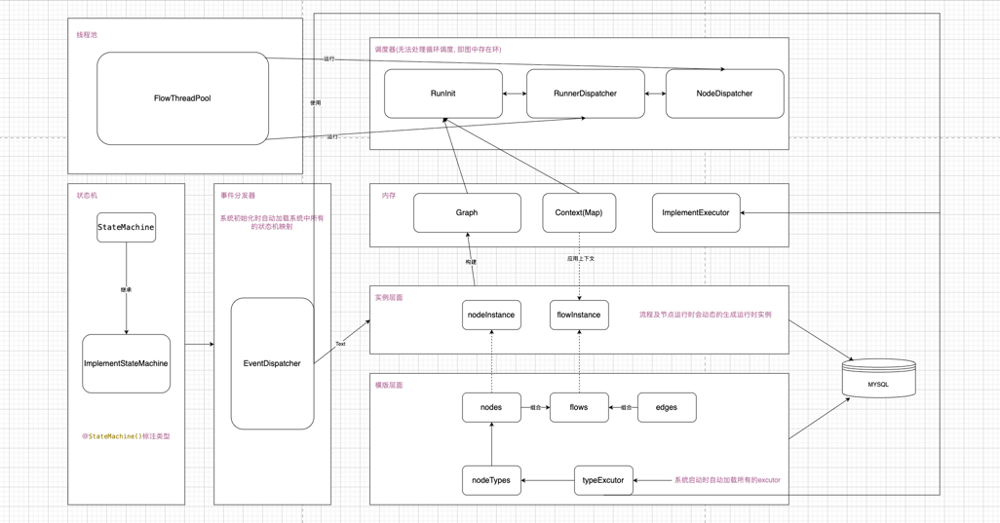

一. 首先调度器会根据构建的图结构计算三个主要的映射表, 1.inDegreesMap(入度表) 2.nodeMap(节点映射表) 3.downStream(下游节点表), 接下来初始化找到所有的入度为0的节点他们是起点
之后会通过"运行调度器"加载这些初始化节点到一个阻塞队列中, 同时根据图中节点总数定义一个latch和CompletableFuture(具体用途见后面), 之后会开启一个协调线程, 在协调线程中会不断
取阻塞队列中的readyNode将其放入线程池调度运行, latch会保证所有的节点运行完成后继续, CompletableFuture会保证流程运行状态外部可知, 对于线程池中的每个readyNode都会交给
"节点调度器"加载对应的"节点执行器"执行结果会动态放置在整个流程实例的上下文中, 如果节点调度器抛出错误则会继续抛出停止, 如果成功执行就会将当前节点的所有下游节点的入度-1, 如果
入度为0则将其加入阻塞队列中循环往复直到整个流程结束, 如果节点出现卡顿等不可控崩溃latch会在规定时间后主动抛错防止浪费系统资源.
二. 对于节点的状态是由状态机来管理的, 每当节点希望更新自身状态时都会主动发出一个事件, 通过"事件分发器"来断定这次事件是一次节点事件还是流程事件进而分配不同的状态机来处理, 特别的
节点转换为complete状态当且仅当其所有上游节点complete, 流程转换为complete状态当且仅当所有节点complete(目前有两种实现方式)
三. 节点的崩溃与恢复(dev)

